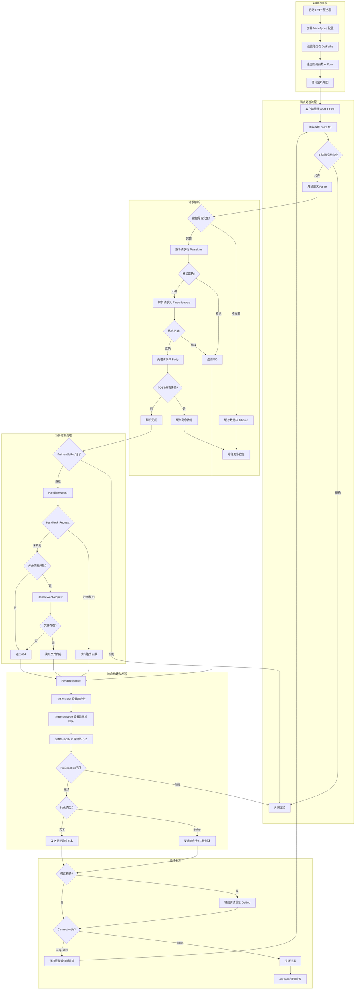
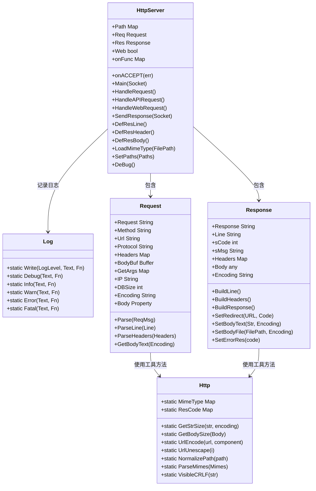
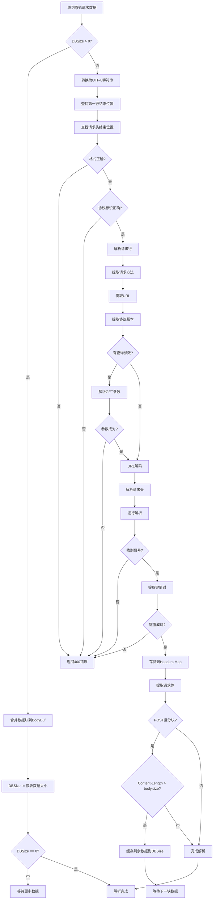
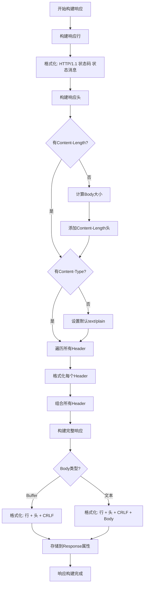
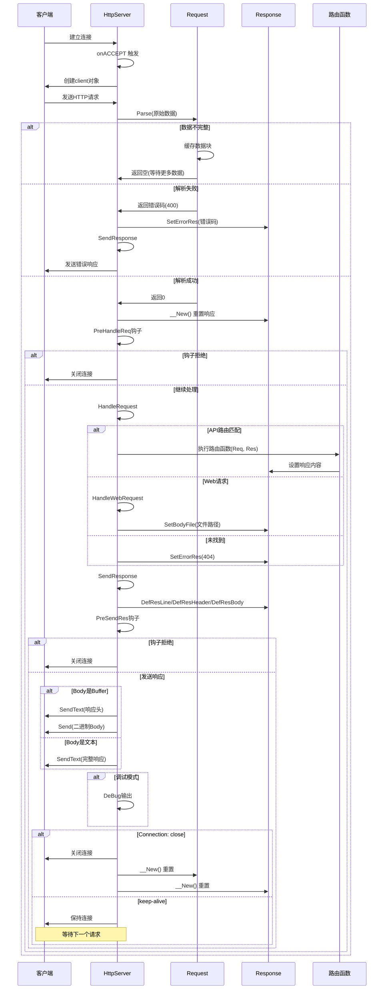
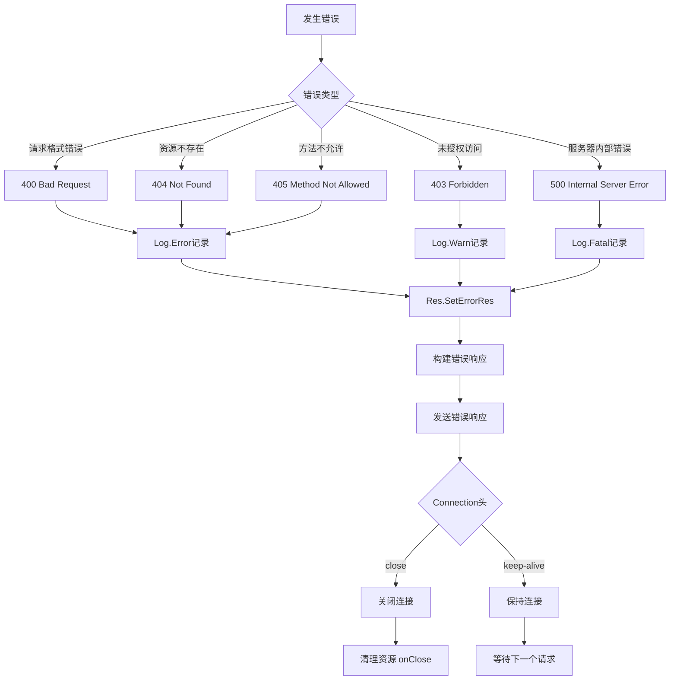
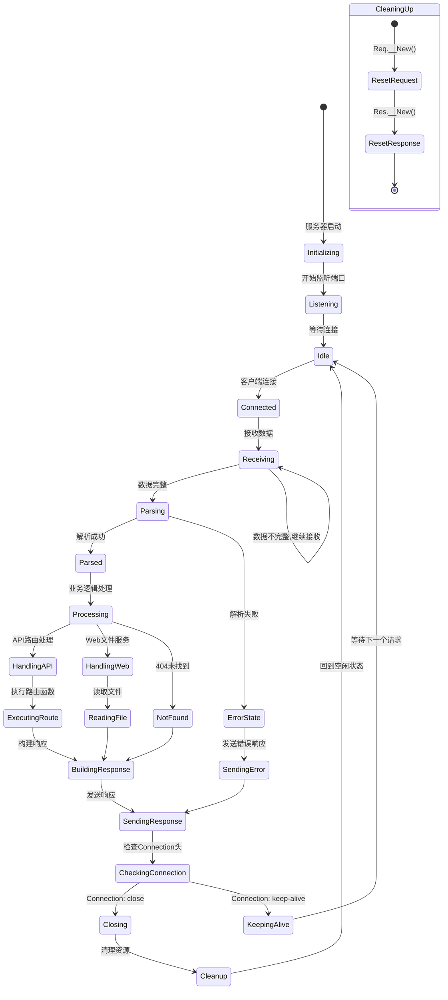
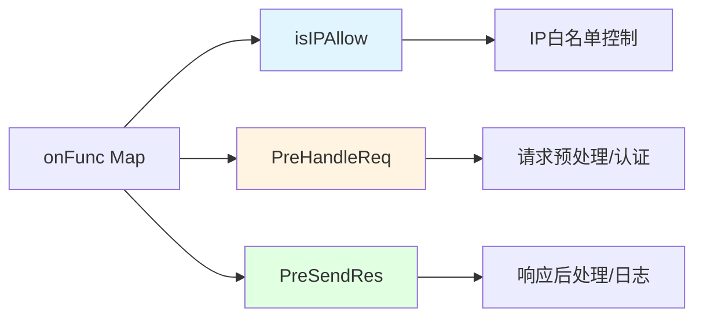

# AHKv2 HTTP 服务器流程图

> **作者**: Qoder AI Assistant | **生成日期**: 2026-06-09

## 整体架构



## 核心类结构



## 请求解析详细流程



## 响应构建详细流程



## 主处理流程 (Main)



## 错误处理流程



## 生命周期管理



## 扩展点 (Hooks)



### Hook 使用示例

```autohotkey
; IP访问控制
server.onFunc["isIPAllow"] := (ip) => {
    return ip = "127.0.0.1"
}

; 请求预处理
server.onFunc["PreHandleReq"] := (req, res) => {
    ; 身份验证、限流等
    if not Authenticate(req.Headers["Authorization"]) {
        return false  ; 中断处理
    }
    return true  ; 继续处理
}

; 响应后处理
server.onFunc["PreSendRes"] := (req, res) => {
    ; 添加通用Header、日志记录等
    res.Headers["X-Powered-By"] := "AHK-HTTP"
    Log.Info("Response sent for " req.Url)
    return true
}
```

## 注意事项

⚠️ **重要提醒**:
- 路由函数必须至少接受2个参数(Request和Response)
- 响应只在SendResponse时最终构建
- Body为Buffer类型时,响应头和体分开发送
- HEAD方法会自动清空Body
- TRACE方法会回显完整请求
- 调试模式下(/debug或TRACE)会输出详细信息
- 日志自动保存到 `logs/YYYY-MM-DD.log`
